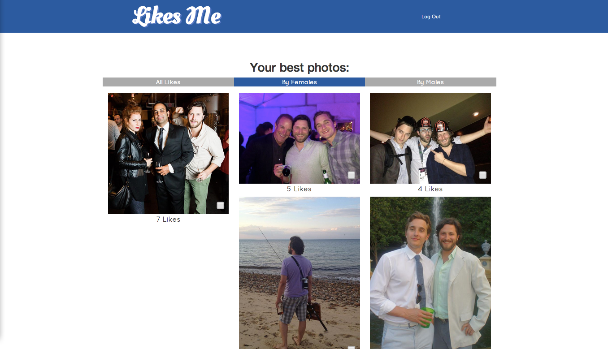
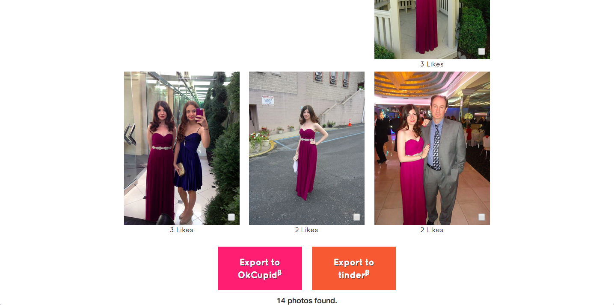

#LIKES ME

##Find your best facebook photos!

* Best photos selected based on 
  * number of likes
    * 1 min
  * number of people tagged in the photo
    * 3 max
* Photos can be sorted by
  * total likes
  * likes by females only
  * likes by males only
* Photos can be exported to dating websites - not implemented yet
  * OKCupid
  * tinder
  
  
##Visit
HEROKU: http://likes-me.herokuapp.com

##Screenshots


1. Organize photos by popularity (All Likes, By Females, By Males)


2. Another example. Find your most liked images!


3. Export directly to *OkCupid* and *tinder* - not yet implemented

##Testing!


##Implementation
Incorporates Facebook's Graph API using the [Koala gem](http://rubygems.org/gems/koala). Uses batched facebook queries to improve efficiency and reduce API calls.

In the example below, in order to organize "Likes" by gender, data related to each user that has "Liked" an individual photo is retrieved in the same API call as the list of each photo's associated "Likes". 

```ruby
  def self.populate_likes_and_tags!(photos, graph)
    photos.each do |photo|
      photo["tag_count"] = graph.get_connection( photo["id"], "tags" ).count

      results = graph.batch do |batch_api|
        batch_api.get_connections(photo["id"], "likes", {:limit => 25}, :batch_args => {:name => "get-likes", :omit_response_on_success => false})
        batch_api.get_objects("{result=get-likes:$.data.*.id}")  
      end

      male_likes = 0
      female_likes = 0
      if results[1].class == Hash   
        results[1].each do |k,v|
          if v["gender"] == "male"
            male_likes += 1
          else
            female_likes += 1
          end
        end
      end

      photo["male_likes"] = male_likes
      photo["female_likes"] = female_likes
    end
  end

```


###Thanks for visiting!!


